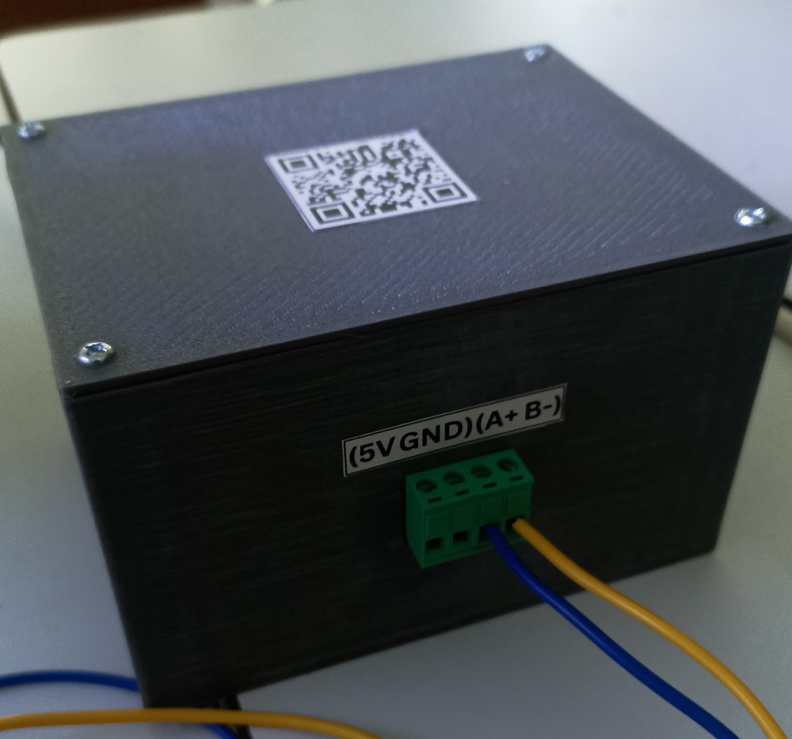
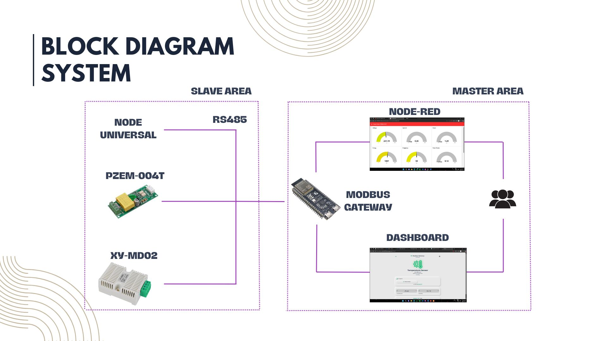

<h1>Modbus Gateway</h1>
A Modbus Gateway is a device or system that functions as a bridge between Modbus RTU and Modbus TCP. The primary purpose of this gateway is to enable integration between devices using different protocols, allowing systems to work seamlessly without the need for changes to existing hardware. In its implementation, the Modbus Gateway acts as:

1. A Modbus RTU master, which reads data from slave devices using RS485 communication.
2. A Modbus TCP server, which provides this data to other systems (e.g., SCADA or Node-RED) over an IP network.

The Modbus Gateway typically maps each register from the RTU protocol to a TCP register address, allowing the monitoring system to access the data without having to re-read it from the slave device.

## Overview
* <a href="#blok-diagram">Block Diagram</a>
* <a href="#circuit-design">Circuit Design</a>
* <a href="#register-mapping">Register Mapping</a>
* <a href="#website">Website</a>
* <a href="#how-to-use">How to Use</a>

## Block Diagram

