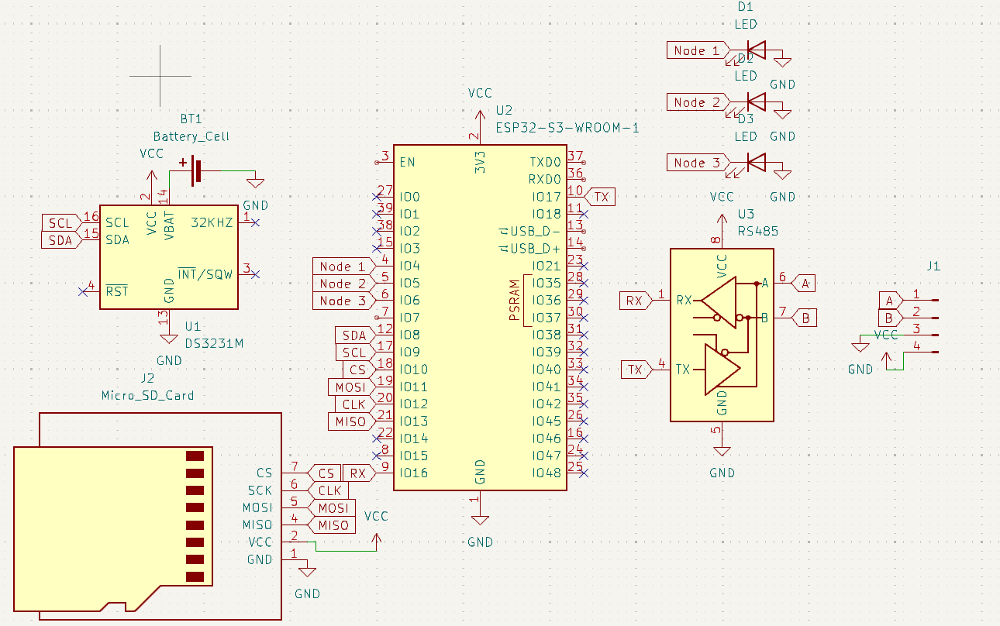

<h1>IoT Modbus Gateway</h1>

A Modbus Gateway is a device or system that functions as a bridge between Modbus RTU and Modbus TCP. The primary purpose of this gateway is to enable integration between devices using different protocols, allowing systems to work seamlessly without the need for changes to existing hardware. In its implementation, the Modbus Gateway acts as:

1. A Modbus RTU master, which reads data from slave devices using RS485 communication.
2. A Modbus TCP server, which provides this data to other systems (e.g., SCADA or Node-RED) over an IP network.

The Modbus Gateway typically maps each register from the RTU protocol to a TCP register address, allowing the monitoring system to access the data without having to re-read it from the slave device.

## Overview
* [Block Diagram](#block-diagram)
* [Circuit Design](#circuit-design)
* [Register Mapping](#register-mapping)
* [Website](#website)
* [How to Use](#how-to-use)

## Block Diagram

In Figure above, the system is designed using RS485 as the communication channel with the slave. Slave readings on the Universal Nodes can be performed flexibly by configuring the Slave ID, Function, or Register address parameters to be read. Meanwhile, readings on the PZEM-004T and XY-MD02 are static and cannot be changed. The reading results are then sent in two outputs: a website-based dashboard via Firebase and a dashboard using the Node-RED platform.

  

The image above shows an overview of the Modbus Gateway workflow in a Modbus communication system. The Modbus Gateway receives data from the Slave via Modbus RTU format with RS485. The ESP32-S3 microcontroller acts as the Modbus Gateway, receiving the data and sending it to the Dashboard. The data acquisition process begins with the Modbus Gateway sending a Frame Request to the Slave using the Modbus RTU Frame Request format. 

## Circuit Design

The pin configuration of each component is explained in the following table.

|No.    |Pin ESP32-S3 | Components    |
| :---: | ---         | ---           |
| 1     | SDA         | RTC           |
| 2     | SCL         | RTC           |
| 3     | CS          | SDCard Module |
| 4     | MOSI        | SDCard Module |
| 5     | CLK         | SDCard Module |
| 6     | MISO        | SDCard Module |
| 7     | RX          | TTL to RS485  |
| 8     | TX          | TTL to RS485  |

## Register Mapping
### 1. Node Universal

  Throughout the system, Universal Nodes can be reconfigured based on parameters such as Slave ID, Function Code, Start Address, and End Address. The addition of the End Address parameter represents an improvement over the previous system, which only used the number of Registers as a reference for reading length. This change was made to make it easier for users to determine the parameters of the Register address to be read. The purpose of creating Universal Nodes is to increase the system's flexibility in reading Modbus-based sensors. Therefore, the Universal Nodes in the Firebase Dashboard still contain raw data, while the data in the Universal Nodes will be processed on the Node-RED platform. 

  
* Slave ID = 1-257
* Function Code = 3/4
* Start Address = Flex
* End Address = Start Address + 1

### 2. PZEM-004T

The PZEM-004T is an AC communication module designed to measure various electrical parameters in real time. Unlike conventional meters, this module does not have a visual display. This module has the ability to measure several key electrical parameters, including:

1. Voltage in the range of 80–260 V  
2. Current in the range of 0–100 A
3. Active power up to 23 kW
4. Frequency in the range of 45–65 Hz
5. Active energy in the range of 0–9999.99 kWh, where the energy value can be reset using software.
6. Power factor from 0.00 to 1.00.

The following is the Register on the PZEM-004T that will be read.

| Address | Function Code  | Description                | Resolution                           |
|:-------:|:--------------:|----------------------------|--------------------------------------|
| 0       | 0x04           | Voltage value              | 1 LSB corresponds to 0.1 V           |
| 1       | 0x04           | Current value low 16 bits  | 1 LSB corresponds to 0.001 A         |
| 2       | 0x04           | Current value high 16 bits | 1 LSB corresponds to 0.001 A         |
| 3       | 0x04           | Power value low 16 bits    | 1 LSB corresponds to 0.1 W           |
| 4       | 0x04           | Power value high 16 bits   | 1 LSB corresponds to 0.1 W           |
| 5       | 0x04           | Energy value low 16 bits   | 1 LSB corresponds to 1 Wh            |
| 6       | 0x04           | Energy value high 16 bits  | 1 LSB corresponds to 1 Wh            |
| 7       | 0x04           | Frequency value            | 1 LSB corresponds to 0.1 Hz          |
| 8       | 0x04           | Power factor value         | 1 LSB corresponds to 0.01            |
| 9       | 0x04           | Alarm status               | 0xFFFF is alarm, 0x0000 is not alarm |
| 1       | 0x06           | Power alarm threshold      | 1 LSB corresponds to 1 W             |
| 2       | 0x06           | Modbus-RTU address         | The range is 0x0001 ~ 0x00F7         |

### 2. XY-MD02

The XY-MD02 is a temperature and humidity sensor with an RS485 communication interface based on the Modbus RTU protocol. This sensor is designed as an industrial device with high reliability and accuracy.The XY-MD02 sensor is capable of measuring two main parameters

1. Temperature: in degrees Celsius (°C), with an accuracy of ±0.3°C,
2. Humidity: in %RH, with an accuracy of ±3%RH.

The following is the Register on the XY-MD02 that will be read.

| Parameter       | Function Code | Address | Resolution                   |
|:---------------:|:-------------:|:-------:|:----------------------------:|
| Temperature     | 0x04          | 0x001   | 1 LSB corresponds to 0.1 °C  |
| Humidity        | 0x04          | 0x002   | 1 LSB corresponds to 0.1%    |
| Device Address  | 0x06          | 0x101   | The range is 0x0001 ~ 0x00F7 |
